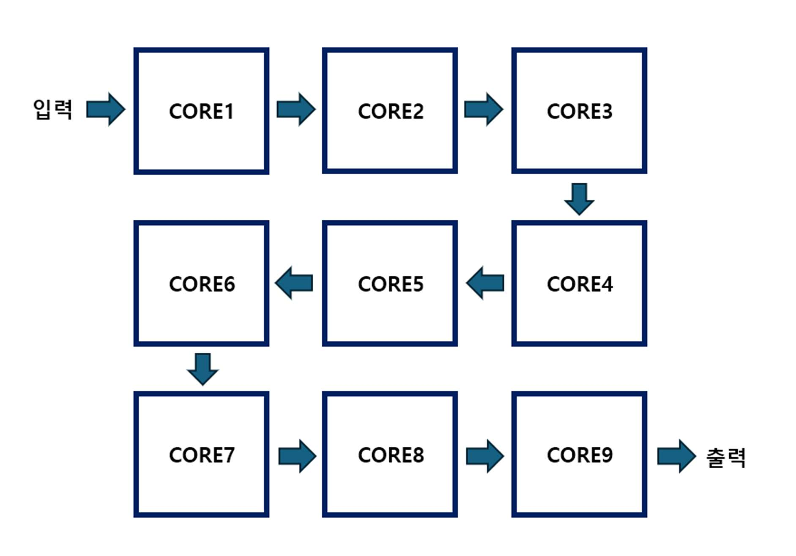
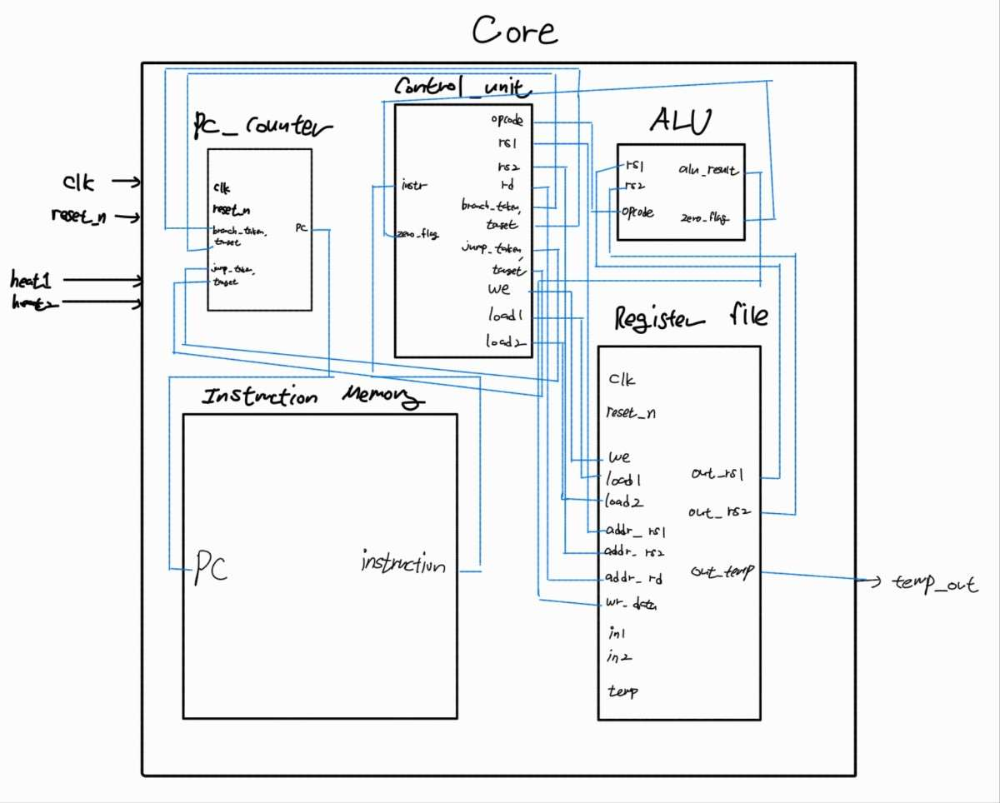
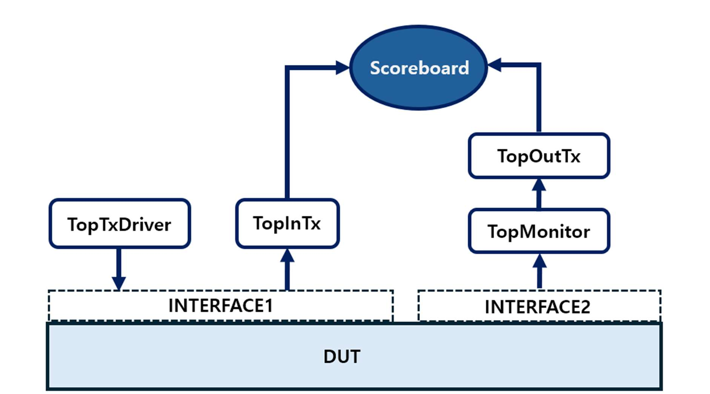

# 3×3 Multi-Core Heatmap Processor

경희대학교 전자공학과 **디지털회로설계및언어** 프로젝트 3 (5조).
9개의 독립 CPU 코어를 3×3 격자로 배치하고, 코어마다 상하좌우 이웃과 heat 값을 주고받아 평균을 반복 계산하는 시스템입니다. 열 확산을 FDM(Finite Difference Method)으로 단순화한 연산을 SystemVerilog RTL로 구현했고, Verilator와 C++로 만든 UVM 스타일 테스트벤치로 검증했습니다.

- 상세 보고서: [`docs/report.md`](docs/report.md) (동작 원리, 합성/전력/딜레이, 검증, 파형)

## 구조

### 시스템 데이터 흐름 (serpentine shift chain)



```
 temp_val ─► core1 ─► core2 ─► core3
                                  │
             core6 ◄─ core5 ◄─ core4
               │
             core7 ─► core8 ─► core9 ─► heat_set ─► heat1..heat9
```

| 단계 | 동작 | 명령어 (PC) |
|---|---|---|
| 초기 입력 | `temp_val`로 1 clk당 1개씩 core9→core1 순서의 초기값 9개를 입력하고, `load1`으로 체인을 따라 shift | `load1` ×9 (1–9) |
| 이웃 값 수집 | 인접 코어의 `$t7`을 `$t2..$t5`로 로드 | `load2` (11, 18) |
| 연산 | `$t1 = (self + Σneighbor) / N` (N = 3/4/5) | `add` ×4, `div` (12–16) |
| 출력 | 결과를 `$t7`로 옮긴 뒤 `load1` 9회로 core9 → `heat_set`까지 shift | `add`, `load1` ×9 (17, 20–28) |
| 반복 | loop counter를 증가시키고 `beq`로 5회 반복 여부 판단 | `add`, `beq`, `jump` (30–33) |

`heat_set`은 core9의 `cal_done`(= `$t12`)이 1인 동안 들어오는 9개 값을 역순으로 정렬한 뒤, 9개가 모두 모이면 `heat1..heat9`로 한 번에 출력합니다.

### 코어 (single-cycle, 18-bit ISA)



```
instr[17:0] = opcode[17:14] | rs1[13:10] | rs2[9:6] | rd/target[5:0]
```

| opcode | 명령 | 동작 |
|---|---|---|
| `0000` | add | `rd ← rs1 + rs2` |
| `0001` | div | `rd ← rs1 / rs2` (divide-by-zero assertion) |
| `0010` | beq | `if (rs1 == rs2) PC ← target` |
| `0100` | jump | `PC ← target` |
| `1110` | load1 | `$t7 ← 이전 코어의 $t7` (shift chain) |
| `1111` | load2 | `$t2..$t5 ← 인접 코어의 $t7` |
| `0101` | stall | NOP |

이웃 수에 따라 regfile과 코어 모듈을 나눴습니다.

| 모듈 | 인스턴스 | 이웃 수 | 제수 (`$t6`) |
|---|---|---|---|
| `core1` + `regfile1379` | core1, core3, core7 | 2 | 3 |
| `core2` + `regfile2468` | core2, core4, core6, core8 | 3 | 4 |
| `core5` + `regfile5` | core5 | 4 | 5 |
| `core9` + `regfile9` | core9 (`cal_done` 출력 추가) | 2 | 3 |

Register map: `$t1` 자기 값, `$t2–$t5` 이웃 값, `$t6` 제수, `$t7` 입출력(shift), `$t8` 상수 1, `$t9` loop limit(5), `$t10` loop counter, `$t11` 상수 0, `$t12` 연산 완료 플래그.

## 디렉터리

```
rtl/   ALU, pc_counter, control_unit, instruction_memory,
       regfile{1379,2468,5,9}, core{1,2,5,9}, heat_set, top
tb/    top.cpp  (Verilator C++ UVM-style testbench)
docs/  report.md (프로젝트 보고서), img/ (구조도, 합성·파형 캡처)
```

## 검증



- **TopTxDriver**: `rand() % 10`으로 난수 입력 9개를 만들어 1 clk에 하나씩 DUT에 인가
- **TopMonitor → TopOutTx**: 사이클 경계(sim_time 350 / 560 / 770)에서 `heat1..9`를 캡처
- **TopScoreboard**: golden model(인접 코어 정수 평균)과 비교. 사이클 1~3 결과를 연쇄적으로 검증
- **Assertion**
  - `ALU.sv`: `div`에서 `rs2 != 0`
  - `top.sv`: 9개 코어의 입력 net이 X(`8'hxx`)가 아닌지 검사
  - `top.cpp`: 입력이 9개보다 적게 캡처되면 에러 출력
- **Coverage** (`cover property`)

| 항목 | 측정값 | 해석 |
|---|---|---|
| core5 `div` (0001) | 5 | 연산 사이클 5회 |
| core5 / core9 `load2` (1111) | 6 / 6 | 첫 사이클 2회 + 이후 사이클당 1회 |
| core1 모듈 `load2` (3 inst) | 18 | 6 × 3 |
| core2 모듈 `load2` (4 inst) | 24 | 6 × 4 |

### 실행

Verilator 5.020에서 확인했습니다.

```bash
make sim     # 빌드 후 시뮬레이션 (scoreboard 결과만 출력)
make cov     # 시뮬레이션 + cover property hit count 출력
make wave    # waveform.vcd를 GTKWave로 열기
```

출력 예시:

```
[SCB] 1st!!! All outputs matched expected values.
[SCB] 2nd cycle !!!!  All outputs matched expected values.
[SCB] 3rd cycle !!!!  All outputs matched expected values.
--- cover property hit counts ---
rtl/core1.sv:91  TOP.top.core*  hits=18
rtl/core2.sv:92  TOP.top.core*  hits=24
rtl/core5.sv:93  TOP.top.core5  hits=6
rtl/core5.sv:94  TOP.top.core5  hits=5
rtl/core9.sv:93  TOP.top.core9  hits=6
```

## 합성 결과 (Oasys / Nitro)

| 항목 | 값 |
|---|---|
| 면적 | 511,915 (10,120 cells); 코어당 약 52–54k 중 register file이 66–69% |
| 전력 | 약 71.0 mW (Nitro instance 합계; 분석 조건은 보고서에 없음) |
| clk edge → PC 갱신 (gate-level sim) | 1.296 ns |
| TB clk → 코어 clk (clock insertion delay) | 0.729 ns |

> 1.296 ns는 clock latency와 PC 레지스터 clk-to-Q를 합친 값이고, reg-to-reg critical path가 아닙니다. 따라서 이 값으로 Fmax(772 MHz)를 추정하면 안 됩니다. 자세한 내용은 [`docs/report.md` §4](docs/report.md#4-합성-및-딜레이-측정)에 있습니다.

## 한계 및 개선 여지

- **Single-cycle, 8-bit 정수 연산**: 나눗셈은 floor이므로 매 반복마다 truncation 오차가 누적됩니다. 또 누적 합도 8-bit 레지스터에 저장하므로, 이웃 합이 255를 넘으면 overflow가 납니다. 보고서의 파형 실행에서는 core5 합이 254까지 올라가 한계에 가까웠습니다. 현재 TB는 `rand() % 10`으로 입력을 제한합니다.
- **통신 오버헤드**: 연산 사이클당 21 clk(PC 12–32) 중 9 clk가 결과를 직렬로 shift하는 `load1`입니다. 결과 수집을 병렬 버스로 바꾸면 사이클 레이턴시를 크게 줄일 수 있습니다.
- **조합 경로 divider**: `/` 연산자가 그대로 합성되므로 critical path의 주요 후보입니다. 제수가 3/4/5 상수라는 점을 이용하면 shift/상수 곱 방식으로 대체할 수 있습니다.
- **Scoreboard 체크 시점 고정**: sim_time 350/560/770 하드코딩 대신 `cal_done` 기반 트랜잭션 캡처로 바꾸면 5사이클 전체를 자동 검증할 수 있습니다.

## Notion 초안 대비 변경 사항

보고서의 최종 코드를 기준으로 복원했고, Verilator 빌드를 위해 아래만 정리했습니다.

- 각 파일의 `` `include ``를 제거하고 `Makefile` 파일 리스트로 컴파일 (중복 module 정의 방지)
- 암시적 net이던 `zero_flag`를 명시적으로 선언하고, 쓰지 않는 `address` 신호 제거
- `VerilatedCov::write()`를 `delete dut` 이전으로 이동 (모델 해제 후 쓰면 쓰레기 카운트가 기록됨)
- 보고서 스크린샷의 regfile loop limit은 `8'd10`이지만, 보고서 본문과 coverage 결과(div 5회, load2 6회)에 맞춰 `8'd5`로 설정
