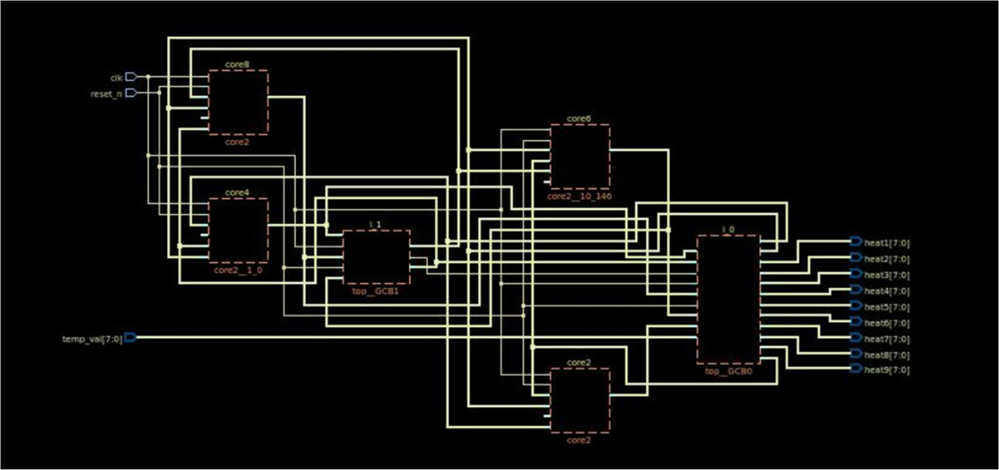
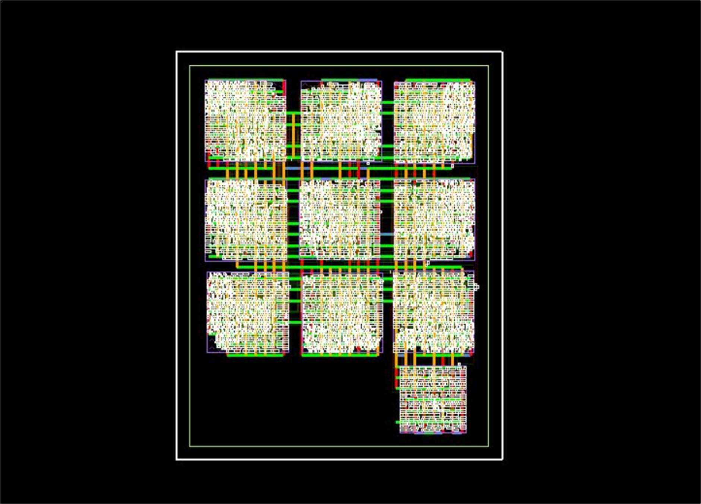
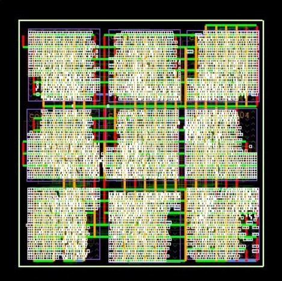
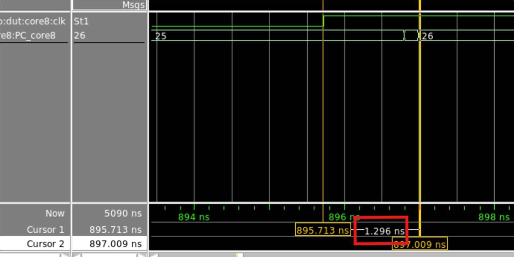
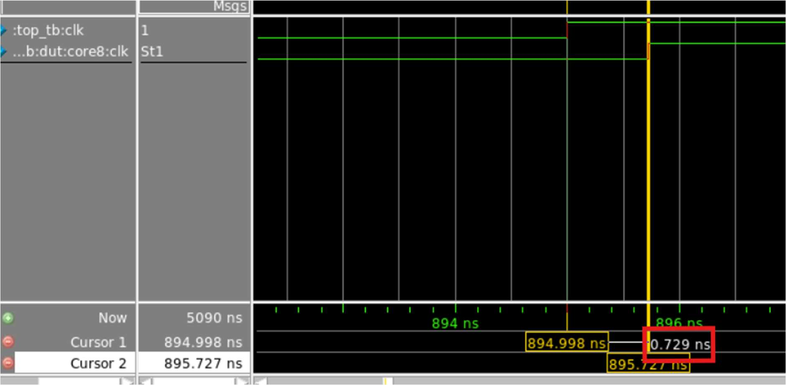
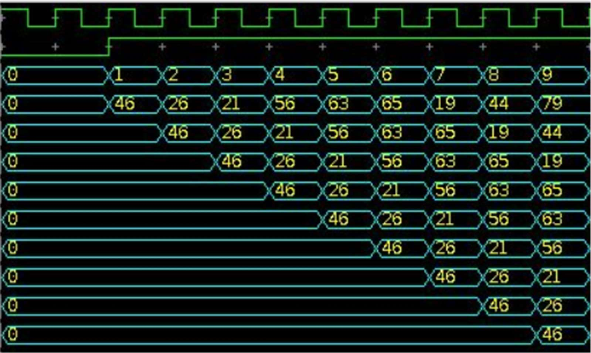
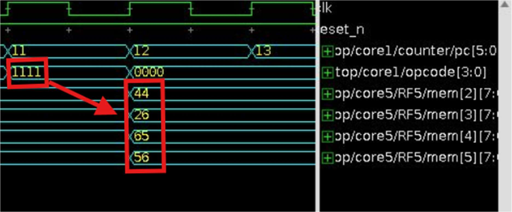
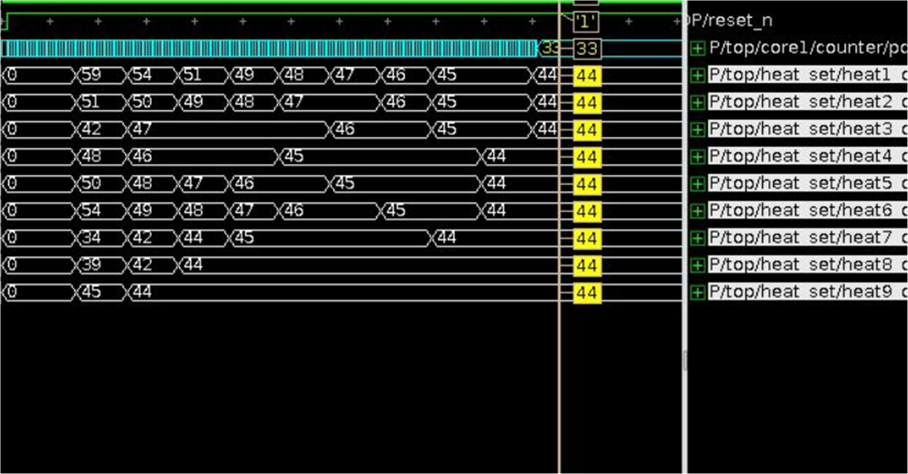

# 3×3 Multi-Core Heatmap Processor

프로젝트를 정리한 문서입니다. 코드는 [`rtl/`](../rtl)과 [`tb/`](../tb)에 있습니다.

## 목차

1. [개요](#1-개요)
2. [동작 원리](#2-동작-원리)
3. [코드 설명](#3-코드-설명)
4. [합성 및 딜레이 측정](#4-합성-및-딜레이-측정)
5. [UVM 방식 테스트벤치 (assertion, coverage)](#5-uvm-방식-테스트벤치)
6. [시뮬레이션 파형](#6-시뮬레이션-파형)

---

## 1. 개요

열 확산 현상을 근사적으로 구현한 3×3 멀티코어 히트맵 연산 시스템입니다. Verilator 시뮬레이션 환경에서 동작하도록 SystemVerilog와 C++로 구현했습니다. 9개 코어는 모두 같은 구조의 CPU이고, 각자 내부 instruction ROM의 프로그램을 독립적으로 실행합니다.

코어는 2차원 격자로 배치됩니다. 각 코어는 상하좌우 이웃 코어와 데이터를 주고받으며 heat 평균을 반복해서 계산합니다. 처음에는 코어마다 다른 heat 값을 받고, 연산을 반복할수록 모든 코어의 값이 수렴합니다. 이는 실제 열전도에서 에너지가 퍼지는 과정과 비슷합니다. 연산 흐름은 수치해석 기법인 FDM(Finite Difference Method)을 디지털 방식으로 단순화한 것과 같습니다.

## 2. 동작 원리


### 2.1 초기 입력

테스트벤치는 매 clk마다 core9 → core1 순서로 초기 heat 값 9개를 `temp_val`에 인가합니다. core1에 들어온 값은 1 clk마다 화살표 방향(serpentine)을 따라 다음 코어로 전달됩니다. 9 clk 뒤에는 core1부터 core9까지 모든 코어에 초기값이 설정됩니다.

### 2.2 연산

각 코어는 상하좌우 코어의 heat 값을 받아 자신의 값과 평균을 내고, 그 결과로 자신의 heat 값을 갱신합니다.

| 코어 | 식 |
|---|---|
| core1 (모서리) | `(core1 + core2 + core6) / 3` |
| core2 (변) | `(core1 + core2 + core3 + core5) / 4` |
| core5 (중앙) | `(core2 + core4 + core5 + core6 + core8) / 5` |

### 2.3 출력

갱신된 heat 값은 입력 때와 같은 방향으로 1 clk마다 옆 코어로 전달됩니다. 이렇게 core1~core9의 값이 차례로 core9에 모이고, 총 9개의 출력이 만들어집니다.

### 2.4 반복

출력된 9개 값은 초기 입력과 같은 방식으로 core1~core9에 다시 투입됩니다. 각 코어는 새 입력으로 이웃 평균을 다시 계산하고 결과를 출력하며, 이것이 두 번째 연산 사이클입니다. 이 과정을 5회 반복하도록 구성했습니다. 사이클이 거듭될수록 전체 heat 분포가 안정화되고, 최종 heat map이 출력됩니다.

### 2.5 명령어 로딩 방식

각 코어는 내부 instruction ROM을 가지고 있어 독립적으로 명령어를 실행합니다. 모든 코어에는 같은 명령어 세트가 SystemVerilog ROM 초기값으로 정의되어 있습니다. 명령어는 1 clk에 1개씩 fetch → decode → execute 되는 single-cycle 구조입니다. 프로그램은 이웃 코어의 heat 값을 받는 명령어와 평균을 계산하는 명령어로 구성됩니다.

## 3. 코드 설명


### 3.1 ISA

```
instr[17:0] = opcode[17:14] | rs1[13:10] | rs2[9:6] | rd / target_address[5:0]
```

| opcode | 명령 | 제어 신호 | 동작 |
|---|---|---|---|
| `0000` | add | `we=1` | `rd ← rs1 + rs2` |
| `0001` | div | `we=1` | `rd ← rs1 / rs2` |
| `0010` | beq | `branch_taken = zero_flag` | `rs1 == rs2`이면 `PC ← target` |
| `0100` | jump | `jump_taken=1` | `PC ← target` |
| `1110` | load1 | `load1=1` | `$t7 ← 이전 코어의 $t7` (shift chain) |
| `1111` | load2 | `load2=1` | `$t2..$t5 ← 인접 코어의 $t7` |
| `0101` | stall | — | NOP |

### 3.2 모듈

| 파일 | 설명 |
|---|---|
| [`ALU.sv`](../rtl/ALU.sv) | 8-bit 입력 2개(`rs1`, `rs2`)와 4-bit `opcode`로 연산합니다. 출력은 `alu_result`와 branch/jump용 `zero_flag`입니다. `div`에서는 `rs2 == 0`이면 `$fatal`로 시뮬레이션을 멈추는 assertion이 있습니다. |
| [`pc_counter.sv`](../rtl/pc_counter.sv) | 6-bit PC입니다. reset이면 0이 되고, `branch_taken`이면 `branch_target`, `jump_taken`이면 `jump_target`으로 가며, 그 외에는 +1 합니다. |
| [`control_unit.sv`](../rtl/control_unit.sv) | instruction을 opcode/rs1/rs2/rd로 decode하고 `we`, `load1`, `load2`, `branch_taken`, `jump_taken`을 생성합니다. branch/jump target은 `rd` 필드를 그대로 씁니다. |
| [`instruction_memory.sv`](../rtl/instruction_memory.sv) | PC 주소의 18-bit instruction을 출력하는 ROM입니다(아래 프로그램 참고). |
| [`regfile*.sv`](../rtl) | 13×8-bit register file입니다. `we`이면 `mem[rd] ← wr_data`, `load1`이면 `mem[7] ← temp`, `load2`이면 이웃 값을 `mem[2..5]`에 저장합니다. `out_temp = mem[7]`은 다음 코어로 넘기는 출력입니다. |
| [`core1/2/5/9.sv`](../rtl) | PC, ROM, control, regfile, ALU를 묶은 코어입니다. `cover property`로 `load2`(1111) 실행 횟수를 측정하고, core5에서는 `div`(0001) 실행 횟수도 측정합니다. |
| [`heat_set.sv`](../rtl/heat_set.sv) | core9에서 순서대로 나오는 heat 값을 정렬해 최종 출력으로 내보냅니다. |
| [`top.sv`](../rtl/top.sv) | 코어 9개와 `heat_set`을 연결합니다. 각 코어 입력이 X(`8'hxx`)가 아닌지 검사하는 assertion이 있습니다. |

코어마다 연산 상수(제수)와 이웃 수가 달라서, 입력 포트 선언이 다른 4종류의 모듈로 나눴습니다.

| 모듈 | 인스턴스 | 이웃 | 제수 | 비고 |
|---|---|---|---|---|
| `core1` + `regfile1379` | core1, 3, 7 | 2 | 3 | |
| `core2` + `regfile2468` | core2, 4, 6, 8 | 3 | 4 | |
| `core5` + `regfile5` | core5 | 4 | 5 | `div` 커버리지 측정 |
| `core9` + `regfile9` | core9 | 2 | 3 | `heat_set`에 `cal_done` 출력 |

**Register map**

| reg | 용도 | reg | 용도 |
|---|---|---|---|
| `$t0` | (미사용) | `$t7` | 입출력: 다음 코어로 넘기는 값 |
| `$t1` | 자기 heat / 연산 누적 | `$t8` | 상수 1 |
| `$t2`–`$t5` | 이웃 heat (up/down/right/left) | `$t9` | loop limit (5) |
| `$t6` | 제수 (3/4/5) | `$t10` | loop counter |
| | | `$t11` | 상수 0 |
| | | `$t12` | 연산 완료 신호 (`cal_done`) |

**`heat_set`**: 입력이 core9, core8, …, core1 순서로 거꾸로 들어오므로 heat 배열 index도 입력과 반대 방향입니다. core9의 연산 완료 신호 `cal_done_in`이 1이면 `count`를 0→8로 올리며 배열에 순서대로 저장하고, `count == 9`가 되면 9개 값을 한 번에 출력합니다.

### 3.3 코어 프로그램 (instruction ROM)

| PC | 명령 | 설명 |
|---|---|---|
| 0 | stall | reset 해제 직후 1 clk 대기 |
| 1–9 | `load1` ×9 | 초기 입력을 체인으로 shift |
| 10 | `add $t1, $t7, $t11` | 받은 값을 자기 heat로 |
| 11 | `load2` | 이웃 값 수집 |
| 12–15 | `add $t1, $t1, $t2..$t5` | 이웃 합 누적 |
| 16 | `div $t1, $t1, $t6` | 평균 |
| 17 | `add $t7, $t1, $t11` | 결과를 출력 레지스터로 |
| 18 | `load2` | 이웃의 새 값 수집 |
| 19 | `add $t12, $t11, $t8` | 연산 완료 신호 = 1 |
| 20–28 | `load1` ×9 | 결과를 core9 → `heat_set`으로 shift |
| 29 | `add $t12, $t11, $t11` | 연산 완료 신호 = 0 |
| 30 | `add $t10, $t10, $t8` | loop counter++ |
| 31 | `beq $t9, $t10, 33` | 5회 끝나면 종료 |
| 32 | `jump 12` | 다음 사이클 |
| 33 | `jump 33` | 정지 |

연산 사이클 하나는 PC 12–32의 **21 clk**이고, 그중 9 clk가 결과 shift(`load1`)입니다. 18번째 `load2`는 17번에서 모든 코어가 동시에 갱신한 `$t7`을 다음 사이클 연산용으로 미리 받아오는 명령입니다.

## 4. 합성 및 딜레이 측정

### 4.1 Oasys 합성 netlist



top 레벨에서 core2/4/6/8은 개별 instance로 남았고, 나머지는 그룹 hierarchy로 묶였습니다.
- `i_0` (`top__GCB0`): `heat_set`, core1, core3, core5
- `i_1` (`top__GCB1`): core7, core9

### 4.2 면적 (Oasys `report_area`)

| Instance | Module | Cells | Cell Area |
|---|---|---:|---:|
| **top** | | **10,120** | **511,915** |
| core1 | core1 | 1,100 | 53,356 |
| └ RF | regfile1379 | 575 | 35,965 |
| core2 | core2 | 1,061 | 51,996 |
| └ RF | regfile2468 | 556 | 35,453 |
| core3 | core1 | 1,095 | 53,291 |
| └ RF | regfile1379 | 565 | 35,676 |
| core4 | core2 | 1,103 | 53,505 |
| └ RF | regfile2468 | 552 | 35,378 |
| core5 | core5 | 1,048 | 51,791 |
| └ RF5 | regfile5 | 567 | 35,676 |
| core6 | core2 | 1,104 | 53,608 |
| └ RF | regfile2468 | 553 | 35,434 |
| core7 | core1 | 1,104 | 53,328 |
| └ RF | regfile1379 | 569 | 35,760 |
| core8 | core2 | 1,061 | 51,996 |
| └ RF | regfile2468 | 556 | 35,453 |
| core9 | core9 | 1,114 | 53,645 |
| └ RF | regfile9 | 571 | 35,807 |
| heat_set | heat_set | 330 | 35,397 |

> 면적 단위는 리포트에 표시되어 있지 않습니다.

표에서 읽을 수 있는 점:
- 코어 1개는 약 51.8k–53.6k이고, 그중 **register file이 약 66–69%** 를 차지합니다. 13×8-bit flip-flop 배열과 read mux가 코어 면적의 대부분입니다.
- `heat_set`은 셀 330개로 코어 셀 수의 약 30%지만, 면적은 35,397로 코어의 약 67%입니다. 9×8-bit 버퍼, 9×8-bit 출력 레지스터, 4-bit count를 합친 flip-flop 약 148개가 셀당 면적이 큰 순차 소자이기 때문입니다.
- 코어 9개 + `heat_set` 합계가 511,913으로 top 511,915와 일치합니다(반올림 차이 2).

### 4.3 전력 (Nitro)

| instance | leakage (nW) | internal (nW) | switching (nW) | total (nW) |
|---|---:|---:|---:|---:|
| core2 | 238 | 4,363,534 | 2,540,572 | 6,904,344 |
| core4 | 243 | 4,473,190 | 2,658,578 | 7,132,010 |
| core6 | 243 | 4,545,040 | 2,768,254 | 7,313,538 |
| core8 | 238 | 4,363,196 | 2,612,314 | 6,975,746 |
| i_0 (heat_set, core1/3/5) | 872 | 17,693,284 | 10,297,934 | 27,992,090 |
| i_1 (core7/9) | 490 | 8,665,909 | 5,992,290 | 14,658,688 |
| **합계** | **2,324** | **44,104,153** | **26,869,942** | **70,976,416** |

> 합계(약 71.0 mW)는 표의 값을 더한 것입니다. 전력 분석 시 동작 주파수와 activity 조건은 보고서에 기록되어 있지 않습니다.

### 4.4 Nitro layout (합성된 멀티코어)



3×3 격자로 배치된 9개 코어 블록과 `heat_set` 블록(우하단)입니다.



별도의 `heat_set` 블록 없이 9개 블록이 정사각형 영역을 3×3으로 채운 배치입니다. 블록 사이 채널로 인접 코어 간 배선(heat 값 전달)이 지나갑니다.

### 4.5 `top_nitro.v` gate-level 시뮬레이션 딜레이

**코어 내부: clk rising edge → PC 갱신 = 1.296 ns**



core8의 clk rising edge(895.713 ns)에서 `PC_core8`이 25→26으로 바뀌기까지(897.009 ns) 1.296 ns가 걸렸습니다. 보고서에서는 이를 772 MHz(= 1/1.296 ns)로 환산하고, 약 740 MHz까지 설정할 수 있다고 판단했습니다.

> **해석 주의.** 이 값은 clock insertion delay와 PC 레지스터의 clk-to-Q를 합친 **launch 쪽 지연**입니다. 최대 동작 주파수를 결정하는 register-to-register critical path가 아닙니다. 이 설계는 single-cycle이므로 실제 critical path는 `PC → instruction ROM → decode → regfile read mux → ALU(8-bit divider) → regfile write setup`이고, Fmax는 STA 리포트(`report_timing`)의 worst slack으로 판단해야 합니다.

**코어 외부: TB clk → core8 clk = 0.729 ns**



테스트벤치 clk(894.998 ns)와 core8 내부 clk(895.727 ns) 사이에 0.729 ns 차이가 있습니다. clock tree/buffer를 거치며 생긴 clock insertion delay(latency)입니다.

## 5. UVM 방식 테스트벤치


Verilator 기반으로 SystemVerilog DUT를 검증하기 위해 UVM 구조를 C++로 구현했습니다([`tb/top.cpp`](../tb/top.cpp)). 입력 인터페이스(INTERFACE1)와 출력 인터페이스(INTERFACE2)가 DUT 입출력을 연결합니다.

| 구성요소 | 역할 |
|---|---|
| `TopTxDriver` | `rand()`로 난수 입력 9개를 만들어 1 clk에 하나씩 DUT에 인가 |
| `TopInTx` | DUT에 넣은 입력값을 Scoreboard에 전달해 golden model 기준 데이터로 사용 |
| `TopMonitor` | 지정된 sim time에 `heat1`~`heat9`를 읽어 `TopOutTx`로 전달 |
| `TopOutTx` | DUT 출력값을 Scoreboard로 전달 |
| `TopScoreboard` | 코어 위치별 이웃 평균으로 기대값을 계산하는 golden model과 DUT 출력을 비교해 pass/fail 판정 |

사이클마다 출력되는 heat 값을 수집해, 3번의 연산 사이클(sim_time 350 / 560 / 770) 결과를 연쇄적으로 golden model과 비교합니다. 사이클 n의 기대값이 사이클 n+1 golden model의 입력이 됩니다.

### 5.1 Assertion

| 위치 | 검사 내용 | 실패 시 |
|---|---|---|
| `top.cpp` (Scoreboard) | 캡처된 입력이 9개 미만 | `[SCB ERROR] Not enough input values captured` 출력 후 종료 |
| `top.cpp` (Scoreboard) | DUT 출력 ≠ golden model | `[SCB] CoreN mismatch: expected=…, actual=…` |
| `top.sv` | 코어 9개의 입력 `val_x !== 8'hxx` | `$fatal("[ASSERTION FAIL] CoreN has invalid input …")` |
| `ALU.sv` | `div`에서 `rs2 != 0` | `$fatal("Division by zero detected …")` |

**오류 주입 실험**: ALU의 `div`(0001)를 `rs1 * rs2`로 바꿔서 시뮬레이션했습니다. 모든 코어의 나눗셈이 곱셈으로 바뀌므로, 9개 코어 전부가 Scoreboard에서 mismatch로 검출되었습니다.

```
input temp_val[0..8] = 0, 3, 1, 2, 2, 4, 9, 7, 5
[SCB] Core1 mismatch: expected=4, actual=42
[SCB] Core2 mismatch: expected=5, actual=92
[SCB] Core3 mismatch: expected=6, actual=60
[SCB] Core4 mismatch: expected=3, actual=60
[SCB] Core5 mismatch: expected=3, actual=90
[SCB] Core6 mismatch: expected=2, actual=40
[SCB] Core7 mismatch: expected=2, actual=18
[SCB] Core8 mismatch: expected=1, actual=24
[SCB] Core9 mismatch: expected=2, actual=21
```

정상 코드에서는 모든 입력 X-check assertion이 통과하고, 나눗셈도 문제없이 수행됩니다.

```
[ASSERTION PASS] Core1 inputs are valid
...
[ASSERTION PASS] Core9 inputs are valid
Division performed normally: 179 / 3 = 59
Division performed normally: 205 / 4 = 51
...
Division performed normally: 254 / 5 = 50
[SCB] 1st!!! All outputs matched expected values.
```

### 5.2 Coverage

- load2 opcode: `1111`
- div opcode: `0001`

나눗셈은 한 사이클에 코어마다 한 번씩만 실행됩니다. 그래서 인스턴스가 하나뿐인 core5의 `div` 실행 횟수를 세면 전체 연산 사이클 수를 간접적으로 확인할 수 있습니다. `load2`는 첫 사이클에 2회(PC 11, 18), 이후 사이클마다 1회(PC 18) 실행되므로 코어 인스턴스 하나당 총 6회입니다.

```
# SystemC::Coverage-3   (coverage.dat, 가독성을 위해 구분자 정리)
C  f=core1.sv  l=100  o=cover  h=TOP.top.core*   18
C  f=core2.sv  l=102  o=cover  h=TOP.top.core*   24
C  f=core5.sv  l=105  o=cover  h=TOP.top.core5    5   ← div
C  f=core5.sv  l=106  o=cover  h=TOP.top.core5    6   ← load2
C  f=core9.sv  l=99   o=cover  h=TOP.top.core9    6
```

| 항목 | 측정 | 기대값 |
|---|---:|---|
| core5 `div` | 5 | 연산 사이클 5회 |
| core5 `load2` | 6 | 2 + 1×4 |
| core9 `load2` | 6 | 2 + 1×4 |
| core1 모듈 `load2` | 18 | 6 × 3 인스턴스 |
| core2 모듈 `load2` | 24 | 6 × 4 인스턴스 |

커버리지 카운트가 코어 인스턴스 수에 비례해 정확히 기록되고, 연산 반복 횟수도 설계 값(5회)과 일치합니다. 이 저장소의 코드로 `make cov`를 실행해도 같은 값이 나옵니다.

## 6. 시뮬레이션 파형

### 6.1 초기 입력 shift



`temp_val`로 core9~core1의 초기값 9개가 1 clk마다 들어가고, 각 코어의 `mem[7]`(`$t7`)을 통해 core1 → core9 방향으로 한 칸씩 전달됩니다. 9 clk 뒤에는 각 코어에 자기 초기값이 자리 잡습니다(Scoreboard 입력 로그와 파형 값이 일치).

### 6.2 `load2`: 이웃 값 수집



- core1: opcode `1111`(PC 11)에서 core6, core2의 값을 `mem[2]`=56, `mem[3]`=44로 load
- core5: opcode `1111`에서 up/down/right/left = core2/8/4/6의 값을 `mem[2..5]` = 44/26/65/56으로 load

### 6.3 연산 (core1)

| PC | 명령 | 값 |
|---|---|---|
| 12 | `add $t1, $t1, $t2` | 79 + 56 = 135 |
| 13 | `add $t1, $t1, $t3` | 135 + 44 = 179 |
| 14–15 | `add $t1, $t1, $t4/$t5` | +0 (core1은 이웃 2개) |
| 16 | `div $t1, $t1, $t6` | 179 / 3 = 59 |

opcode `1110`(load1)에서 각 코어의 계산값이 `mem[7]`을 통해 `heat_set`으로 shift되고, output port로 한 번에 나옵니다. 이 출력이 C++ `TopOutTx`를 거쳐 Scoreboard로 들어가 golden model과 비교되며, 값이 일치했습니다(Core1 expected=59, actual=59).

### 6.4 수렴



각 코어의 heat 값이 여러 사이클에 걸쳐 인접 코어와 평균을 반복하면서 점차 균일해지는 것을 확인할 수 있습니다. 이 캡처에서는 1사이클 결과 59/51/42/48/50/54/34/39/45가 모두 44로 수렴했고, 모든 코어의 PC는 33(jump self)에서 정지했습니다.

> 이 파형에서는 `heat1`이 0 이후 9번 바뀌므로 최소 9사이클이 돌았습니다. loop limit 10 설정으로 찍은 것으로 보입니다. 저장소 코드는 보고서 본문과 커버리지 결과에 맞춰 loop limit 5를 사용합니다.
